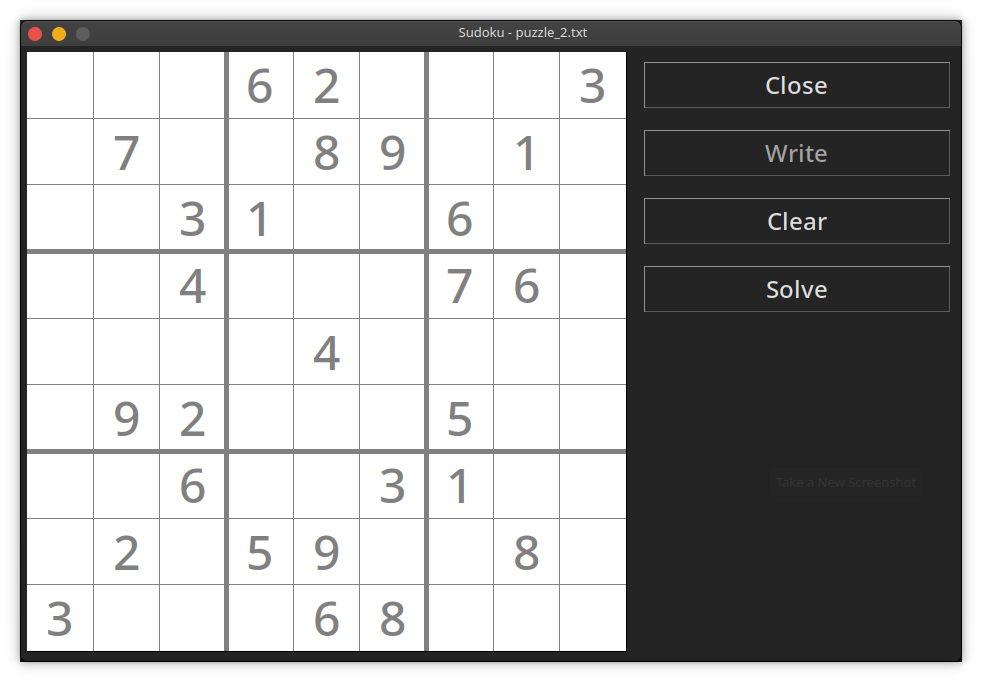
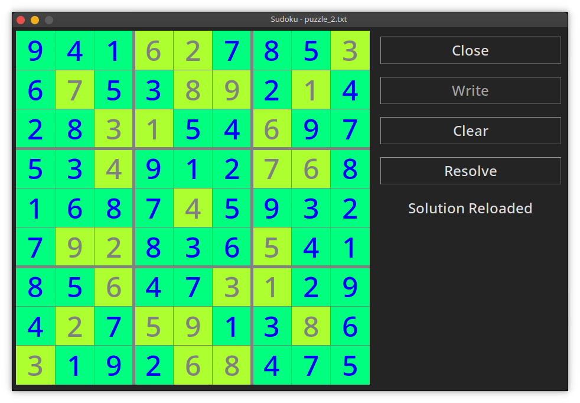

# Overview

This project is capable of solving a Sudoku puzzle using a genetic algorithm. Puzzle are read from open dialog and it must be a plain text file containing a string of 9 x 9 digits separated by spaces and end line. Zero is used to represent an unknown digit, whereas numbers in [1, 9] are assumed to be known/given.

Run the code by executing `python main.py` at the command line. Example output looks like this:

